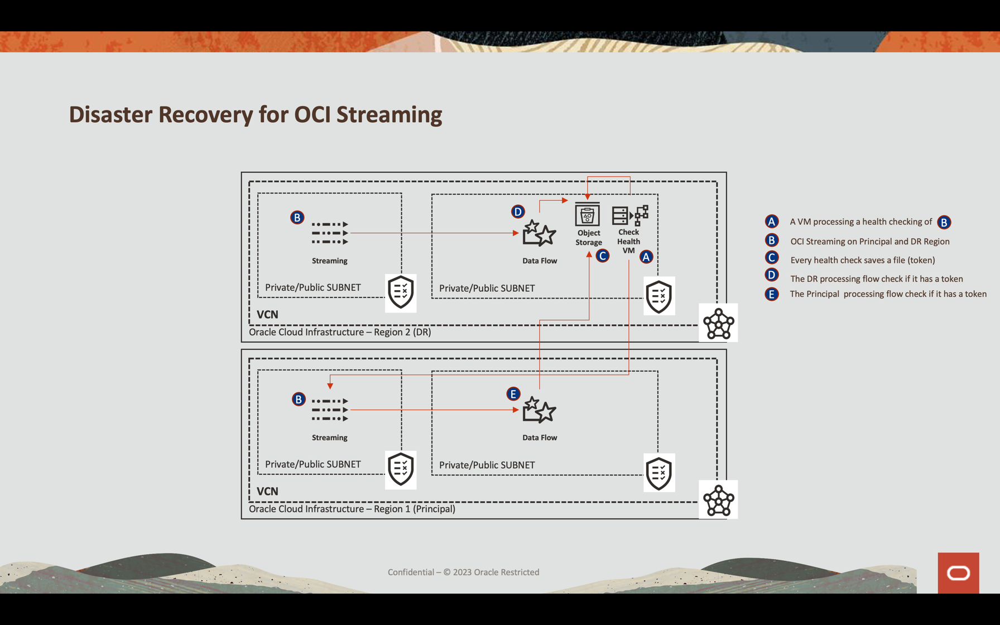
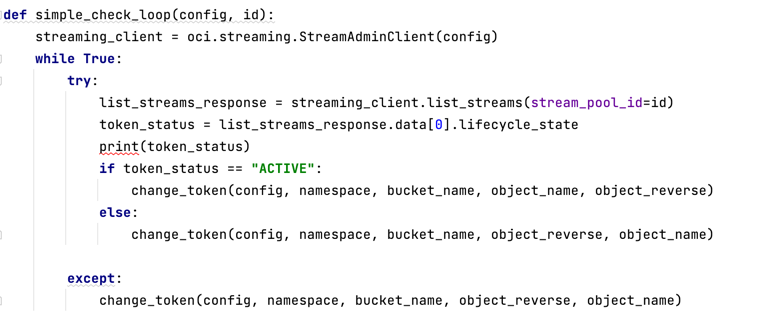
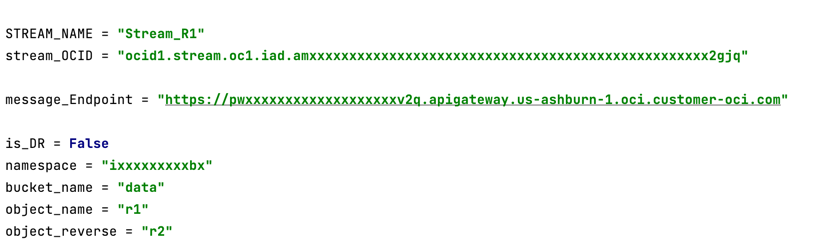
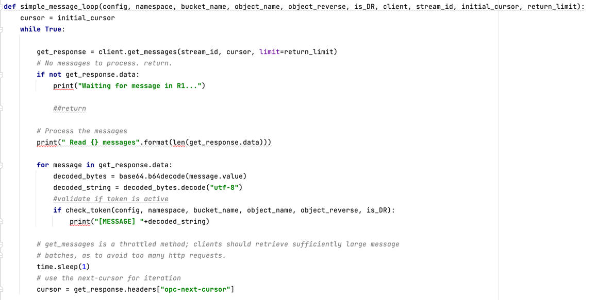
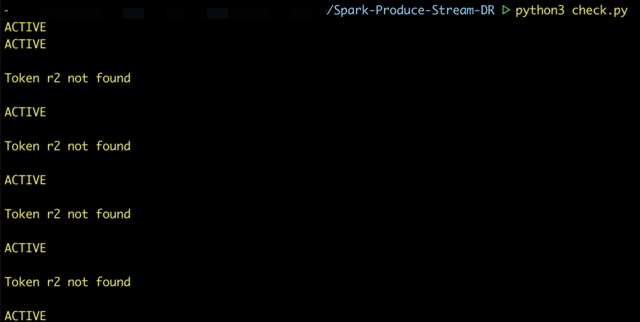
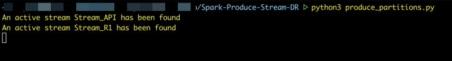
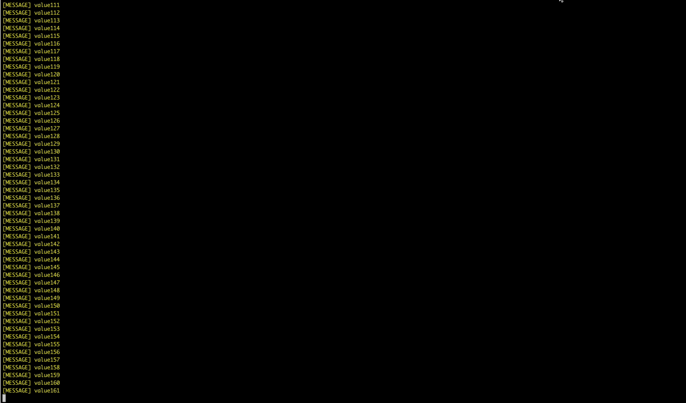
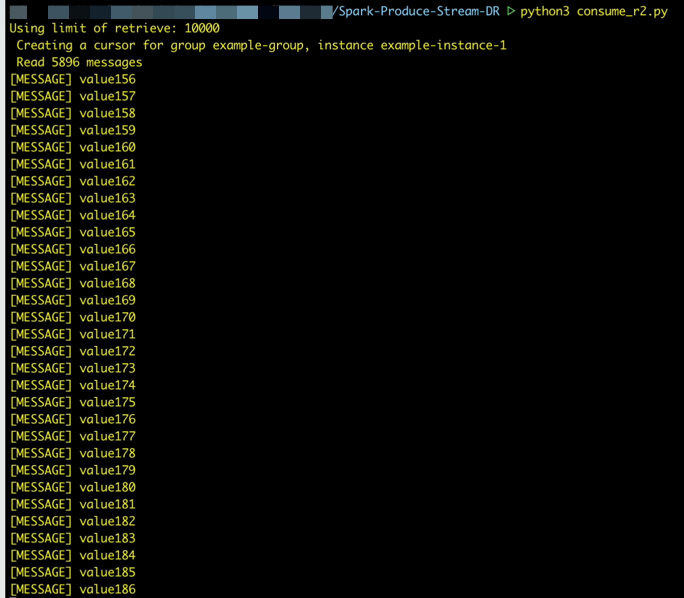

# Disaster Recovery for Oracle Cloud Streaming

### Introduction

This is a streaming data-based Disaster Recovery demo solution. In this demo, I show how streaming data can be used to build resilient and reliable disaster recovery solutions.

This solution uses Oracle Cloud Streaming in two different regions to produce data simultaneously. This data is processed with Spark (or any other code for processing data) only in the main region, ensuring processing efficiency. However, in the event of a failure in the primary region, this solution is capable of transferring control to the disaster region via a token stored in a file on Oracle Cloud Object Storage.

This solution is an example of how data streaming can be integrated with other cloud technologies to provide complete Disaster Recovery solutions. Through real-time data replication and rapid disaster recovery, data streaming is a valuable technique for disaster recovery.

This material will guide you through the necessary steps to replicate this solution in your own infrastructure. I hope you find this guide useful and that you can use the concepts presented here in your own disaster recovery solutions.

### Disaster Recovery for Streaming is a hard engineering work

There are some approaches to resolve a Streaming Failure and there are a lot of concerns about how to implement a reliable and resilient solution. Some important components needs to be considered:

- Replicate Streaming Data from Principal Region to DR Region
- Effort of Development
- Care of Sequenced Events
- Latency
- Cost
- Idempotency
- Conectivity
- Time to consume in DR Region after a disaster
- Governance
- Resilience

### Why not to Replicate?

Comparing with a replication process, if the Principal Region fails, the replication stops imediatelly. So the process does not continue.
The solution for this is maintain an active-active strategy, from producing, processing and consuming.

Replicating from Principal Region to DR Region takes time, so latency is critical.

### Cost

Adopting the strategy to produce to Principal Region and DR Region in an active-active architecture demands an increase of cost but it can be reduced. Let's see what cost is increased and what can be done to reduce:

| Component | Strategy                                                                                                                                                                                                                                                                                |Status|
|-------|-----------------------------------------------------------------------------------------------------------------------------------------------------------------------------------------------------------------------------------------------------------------------------------------|-------|
| Streaming | Produce and Consume in both regions                                                                                                                                                                                                                                                     |Cost x2|
| Spark | Data is consumed and processed in original region. If it fails, activation the processing automatically in DR region. A token says wich region process or not the data. The DR region assumes if token changed to DR. If Principal turns on again, the DR Spark needs to be turned off. |Cost can be reduced

### Analyzing the Code 

The main code is **check.py**. It checks all the time if the Principal Region Streaming in on-line. If it is on-line, then a file named **r1** (as configured in the code) will be written on the Object Storage otherwise, a file named **r2** will be written on the same bucket. This is necessary because each code for processing (one in the Principal Region and another region are basically the same code) has a condition searching for what file is saved on object storage. With this approach, cost can be saved cutting further processing to the end.

---
**check.py**

- This code needs to run continously to check if the Principal Region is running
- The **change_token** saves a file in an **Object Storage** bucket
- A token named **r1** assigns the principal region
- A token named r2 assigns the DR region

---
**consume_r1.py and consume_r2.py**

- This code represents a typical streaming consumer through an API Gateway REST services with the OCI SDK code 
- It needs to be implemented in your Spark Streaming Consumer
- In your DR Streaming deployment, setup **is_DR** attribute with **True**
- In your Principal Streaming Region, setup **is_DR** with **False**

- The DR is an Active-Active system
- Both the Principal Region (r1) and DR Region (r2) is working and consuming the streaming
- But the method **check_token()** blocks the processing in the DR region
- If Principal Region fails, the token changes from **r1** to **r2** because of the **check** Region code

Change from one region to another does not guarantee **idempotency**. The DR Region assumes data imediatelly after the Principal Region fails but it could generate duplicate messages.
We can't know where the original data stopped so some of it could be processed.

### Preparing for Execution

1. Setup the variables for the:

- **check.py**: This code needs to run in DR Region. It checks everytime if Principal Region (r1) in on-line. If r1 is OK, it saves a file named **r1** on the object storage; otherwise saves **r2** and deletes **r1** file and vice-versa.

|VARIABLE NAME| VALUE                                               |EXAMPLE|
|--------------|-----------------------------------------------------|------|
|STREAM_NAME| The name of the Principal Region OCI Streaming      |Stream_R1|
|stream_OCID| The OCID of the Principal Region OCI Streaming      |ocid1.stream.oc1.iad.amxxxxxxxxxxxxxxxxxxxxxxxxxxxxxxxxxxxxxxxxxxxxxxxxxx2gjq|
|stream_pool_id| The OCID of the Principal Region OCI Streaming Pool |ocid1.streampool.oc1.iad.amaxxxxxxxxxxxxxxxxxxxxxxxxxxxxxxxxxxxxxxxxxxxxxxxxxxodlq|
|namespace| The DR tenant namespace                             |"ixxxxxxxxxbx"|
|bucket_name| The DR Bucket Name to receive the token             | data|
|object_name| The token name for Principal Region                 | r1|
|object_reverse| The token name from DR Region                       | r2|

- **produce_partitions**: This code just produce data for the Principal and DR region at same time. So the solution is not produce to the Principal Region and have a process separated for replicate from Principal to DR Region. This solution produces the data for both region.

| VARIABLE NAME  | VALUE                                                       | EXAMPLE   |
|----------------|-------------------------------------------------------------|-----------|
| STREAM_NAME_R1 | The Principal Region OCI Streaming Name                     | Stream_API |
| STREAM_NAME_R2 | The DR Region OCI Streaming Name                            | Stream_R1 |
| compartment_r1 | The Compartment Name for the Principal Region OCI Streaming |ocid1.compartment.oc1..aaaxxxxxxxxxxxxxxxxxxxxxxxxxxxxxxxxxxxxxxxxxxxxxxxxxxnzq"|
| compartment_r2 | The Compartment Name for the DR Region OCI Streaming        |ocid1.compartment.oc1..aaaxxxxxxxxxxxxxxxxxxxxxxxxxxxxxxxxxxxxxxxxxxxxxxxxxxnzq"|

>**Note**: This demo was written to illustrate a DR Streaming but it executes in the same tenant, so the **produce_partitions.py** works with 2 streaming services on the unique tenant. If you want to execute this demo in 2 different tenants, you need to change the code to authenticate your OCI CLI mechanism for each produce methods.

- **consume_r1.py**: This code represents a process and could be added to a **Spark** process. This process needs to be executed continuously as part of a real-time processing. As said in previously section, there is a condition to stop processing, this is important to not duplicate processing at Principal and DR region.

| VARIABLE NAME  | VALUE                                                                                                | EXAMPLE                                                                       |
|----------------|------------------------------------------------------------------------------------------------------|-------------------------------------------------------------------------------|
|STREAM_NAME | The Principal OCI Streaming name                                                                     | Stream_R1                                                                     |
|stream_OCID | The Principal OCI Streaming OCID                                                                     | ocid1.stream.oc1.iad.amxxxxxxxxxxxxxxxxxxxxxxxxxxxxxxxxxxxxxxxxxxxxxxxxxx2gjq |
|message_Endpoint| This is the Principal OCI Streaming endpoint                                                         | https://pwxxxxxxxxxxxxxxxxxxxv2q.apigateway.us-ashburn-1.oci.customer-oci.com |
|is_DR| This flag represents the Principal and the DR environment. This Code always represents the Principal | False                                                                         |
|namespace| The Principal OCI Namespace                                                                          | ixxxxxxxxxbx                                                                  |
|bucket_name| The DR Bucket Name to receive the token                                                              | data                                                                          |
|object_name| The token name for Principal Region                                                                  | r1                                                                            |
|object_reverse| The token name from DR Region                                                                        | r2                                                                            |

- **consume_r2.py**: This code represents a process and could be added to a **Spark** process. This process needs to be executed continuously as part of a real-time processing. As said in previously section, there is a condition to stop processing, this is important to not duplicate processing at Principal and DR region. The consumer code for the Principal and DR Regions are pratically the same, the difference is the variables. **is_DR** represents what is the Principal and what is the DR Region.

| VARIABLE NAME  | VALUE                                                                                                | EXAMPLE                                                                       |
|----------------|------------------------------------------------------------------------------------------------------|-------------------------------------------------------------------------------|
|STREAM_NAME | The Principal OCI Streaming name                                                                     | Stream_API                                                                    |
|stream_OCID | The Principal OCI Streaming OCID                                                                     | ocid1.stream.oc1.iad.amxxxxxxxxxxxxxxxxxxxxxxxxxxxxxxxxxxxxxxxxxxxxxxxxxx2gjq |
|message_Endpoint| This is the Principal OCI Streaming endpoint                                                         | https://pwxxxxxxxxxxxxxxxxxxxv2q.apigateway.us-ashburn-1.oci.customer-oci.com |
|is_DR| This flag represents the Principal and the DR environment. This Code always represents the Principal | True                                                                          |
|namespace| The Principal OCI Namespace                                                                          | ixxxxxxxxxbx                                                                  |
|bucket_name| The DR Bucket Name to receive the token                                                              | data                                                                          |
|object_name| The token name for Principal Region                                                                  | r1                                                                            |
|object_reverse| The token name from DR Region                                                                        | r2                                                                            |

2. Running the Codes

Start the code in this sequence:

- check.py
- produce_partitions.py
- consume_r1.py
- consume_r2.py

### Test the Fail

OCI Streaming cannot be stopped manually, so the test needs to be done with another strategy.
You can stop the **check.py** code and change the Principal OCI Streaming variables to simulate an unvailable streaming environment.
Run again the **check.py** and you can see that consume_r1.py stopped to consume and show messages in screen and imediatelly consume_r2.py messages are showed.

- **check.py**: When this code stared, it will check the health of Principal Region. In this demo, the parameters was changed for a DELETED Streaming Service and executed again.

- **produce_partitions.py**

- **consume_r1.py**: The Principal Region started consuming data and stopped automatically when token changed to the DR Region.

- **consume_r2.py**: The DR Region started consuming, but because of condition in the code and the token status (started at r1). The process started to consume only when the check.py changed the r2 token.  

It works!!!!
    