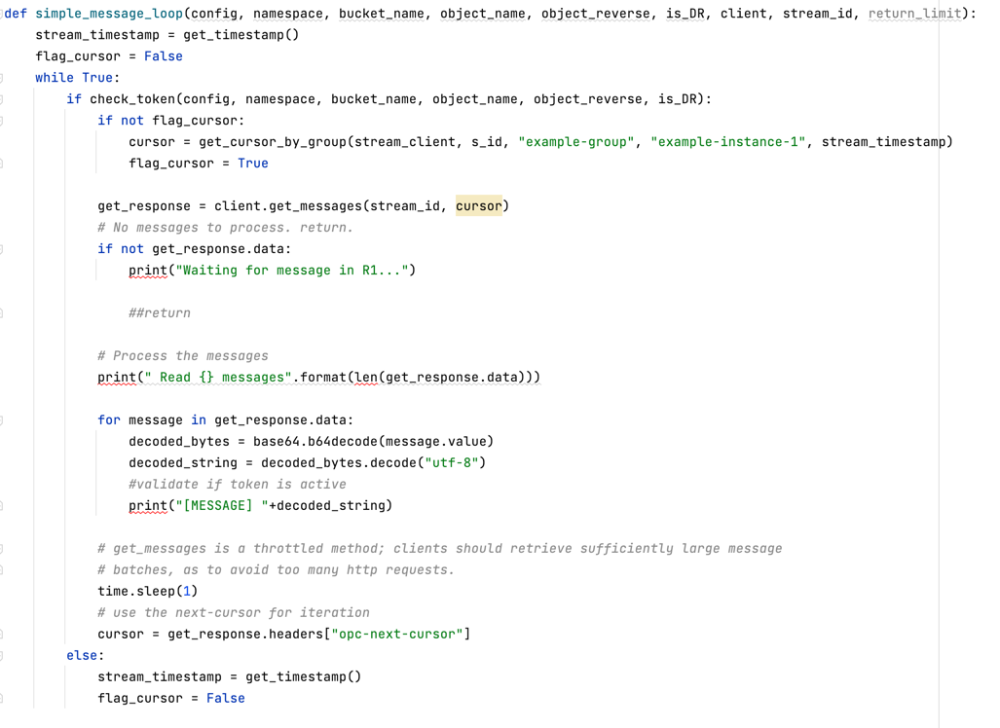

- This code needs to run continously to check if the Principal Region is running
- The **change_token** saves a file in an **Object Storage** bucket
- A token named **r1** assigns the principal region
- A token named r2 assigns the DR region

- This code represents a typical streaming consumer through an API Gateway REST services with the OCI SDK code 
- It needs to be implemented in your Spark Streaming Consumer
- In your DR Streaming deployment, setup **is_DR** attribute with **True**
- In your Principal Streaming Region, setup **is_DR** with **False**

- The DR is an Active-Active system
- Both the Principal Region (r1) and DR Region (r2) is working and consuming the streaming
- But the method **check_token()** blocks the processing in the DR region
- If Principal Region fails, the token changes from **r1** to **r2** because of the **check** Region code

Change from one region to another does not guarantee **idempotency**. The DR Region assumes data imediatelly after the Principal Region fails but it could generate duplicate messages.
We can't know where the original data stopped so some of it could be processed.
